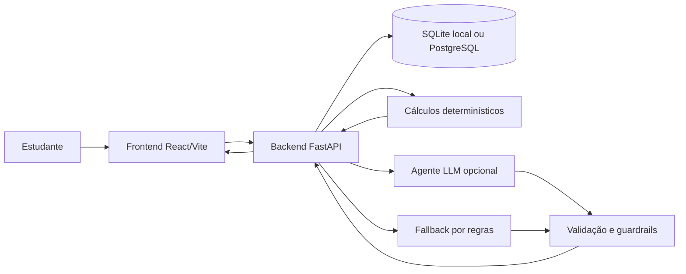

# EstudaUnB

EstudaUnB é um MVP para estudantes da Universidade de Brasília organizarem disciplinas, conteúdos, avaliações, faltas, calendário acadêmico e planejamento semanal de estudos. O projeto demonstra o ciclo agente → API → produto com guardrails, fallback determinístico e dados auditáveis.

## Produto

Problema: estudantes precisam transformar PDFs, planos de ensino, avaliações e conteúdos em um plano de estudo viável, respeitando datas reais e regras acadêmicas da UnB.

Stakeholders: estudante, docente/orientador da disciplina de IA/ML e avaliadores do trabalho.

Funcionalidades principais:

- autenticação com usuário de demonstração por variáveis de ambiente; neste branch `dev`, o cadastro público permanece apenas informativo;
- cadastro manual de disciplinas;
- importação revisada de atestado de matrícula em PDF;
- consulta opcional a componentes públicos do SIGAA;
- plano de ensino confirmado com avaliações;
- conteúdos hierárquicos e associações com avaliações;
- cálculo determinístico de nota, menção, frequência e risco;
- calendário acadêmico mensal e agenda semanal;
- agente de recomendação e explicação com fallback.

Fluxo agente → API → produto:



## Arquitetura

- Frontend: React + Vite + TypeScript, SPA com rotas públicas e protegidas.
- Backend: FastAPI, Pydantic, SQLAlchemy e Alembic.
- Banco: SQLite em desenvolvimento por padrão; PostgreSQL em produção via `DATABASE_URL`.
- Agente: Google/Gemini opcional; sem chave ou com erro usa fallback determinístico.
- Scraper: somente páginas públicas do SIGAA/UnB para componentes curriculares.
- Guardrails: validação de schema, evidência textual, isolamento por usuário, sem login no SIGAA, sem armazenar PDF bruto por padrão.
- Fallback: cadastro manual, parser local, regras determinísticas e mensagens amigáveis.

## Execução local

Requisitos: Python 3.12, Node 22, Docker opcional.

Copie `.env.example` para `.env` e ajuste localmente. Não commite `.env`.

Variáveis principais:

- `DATABASE_URL`: `sqlite:///./data/estudaunb.db` local ou URL PostgreSQL/Neon em produção;
- `AUTH_SECRET`: segredo longo para tokens;
- `EMAIL_TESTE` e `SENHA_TESTE`: credenciais do usuário de demonstração;
- `ALLOW_REGISTRATION`: autoridade do backend para cadastro público; aceita `true`, `1`, `yes` e `on`;
- `GOOGLE_API_KEY`: opcional;
- `CORS_ORIGINS`: origens do frontend;
- `VITE_API_URL`: URL pública do backend para o frontend.

Backend sem Docker:

```bash
cd backend
python -m venv .venv
source .venv/bin/activate
pip install -r requirements.txt
alembic upgrade head
python scripts/seed_demo.py
uvicorn app.main:app --reload
```

Frontend sem Docker:

```bash
cd frontend
npm install
npm run dev
```

Docker Compose:

```bash
docker compose up --build
```

URLs locais:

- Frontend: http://localhost:5173
- Backend health: http://localhost:8000/api/health
- Swagger: http://localhost:8000/docs

## Scripts

Backend:

```bash
cd backend
alembic upgrade head
python scripts/seed_demo.py
pytest
```

Frontend:

```bash
cd frontend
npm run build
```

Catálogo SIGAA: use `GET /api/sigaa/components/search?query=<codigo>` e `PATCH /api/disciplines/{id}/sigaa-component`.

## Deploy

O repositório inclui `render.yaml` para separar:

- backend como Web Service Docker;
- frontend como Static Site.

Banco recomendado: Neon ou PostgreSQL compatível, informado por `DATABASE_URL`.

Backend no Render:

- configurar `DATABASE_URL`, `AUTH_SECRET`, `EMAIL_TESTE`, `SENHA_TESTE`, `ALLOW_REGISTRATION=true`, `CORS_ORIGINS`;
- opcionalmente configurar `GOOGLE_API_KEY`;
- health check: `/api/health`;
- startup executa `alembic upgrade head`;
- porta usa `$PORT`.

Frontend no Render:

- configurar `VITE_API_URL` com a URL pública do backend;
- build: `npm ci && npm run build`;
- publish: `dist`;
- fallback SPA: rewrite `/*` para `/index.html`.

Limitações de serviços gratuitos: cold start, banco pode dormir, latência maior no primeiro acesso e limites de conexão.

## Autenticação e cadastro

`GET /api/auth/registration-status` é a única fonte de verdade para o frontend decidir se exibe o formulário. `POST /api/auth/register` exige nome, e-mail válido, senha com no mínimo oito caracteres, maiúscula, minúscula e número, além do aceite dos termos. Em caso de sucesso, o backend cria um usuário ativo, devolve o mesmo contrato de token do login e o frontend autentica a nova conta.

E-mails são normalizados e protegidos por índice único; senhas usam PBKDF2-SHA256 com salt e nunca são persistidas em texto puro. Defina `ALLOW_REGISTRATION=false` para bloquear novas contas sem afetar login ou o usuário de demonstração. Nenhuma variável `VITE_*` controla essa decisão.

## Agente

O backend calcula nota, menção, frequência, prazos e janelas de estudo deterministicamente. O agente pode explicar prioridades, adaptar linguagem, selecionar estratégias permitidas e relacionar evidências.

Estratégias permitidas:

- prática de recuperação;
- prática distribuída;
- intercalação;
- exemplos concretos/resolvidos;
- autoexplicação.

Guardrails:

- não inventar data, peso, nota, ementa ou professor;
- não avaliar docente;
- não afirmar aprovação final sem frequência conhecida;
- não preparar sessão após a prova;
- não exibir erro técnico cru ao usuário.

Monitoramento mínimo registra latência, fallback, motivo do fallback, eventos extraídos/rejeitados, plano gerado e sessões rejeitadas por prazo, sem senha, token, chave ou documento integral.

## Calendário

Eventos persistidos em `academic_events` também distinguem a origem `study_plan` e o tipo `study_block`. Um bloco planejado reserva tempo no calendário; ele não comprova que uma atividade de estudo foi executada.

Regras principais:

- avaliação datada cria/atualiza evento vinculado;
- editar data, título ou peso da avaliação atualiza a projeção temporal;
- excluir avaliação cancela o evento vinculado, sem apagar silenciosamente o histórico;
- evento manual não é sobrescrito por avaliação;
- planejamento semanal gera apenas preview; persistência dos blocos exige confirmação humana;
- eventos e consultas são isolados por usuário autenticado;
- timezone padrão: `America/Sao_Paulo`.

A rota protegida `/study-plan` concentra disponibilidade, prioridades automáticas, explicação de capacidade, preview e confirmação. A rota `/calendar` mostra os blocos confirmados em visões mensal e semanal temporal, sem duplicar o formulário de planejamento.

Um bloco planejado é diferente de uma atividade de estudo executada. O catálogo de métodos e as recomendações contextuais estão implementados, mas o ciclo de atividade/timer da Spec 015 e a adaptação pós-estudo da Spec 016 ainda não estão implementados.

## Assistente contextual

As páginas autenticadas disponibilizam um drawer recolhível. O frontend envia apenas contexto estruturado, como rota e identificadores selecionados; o backend reconstrói disciplinas, avaliações, prioridades, capacidade, eventos e previews pertencentes ao usuário.

`POST /api/assistant/contextual/messages` é somente leitura. A resposta pode conter ações tipadas. Navegação não altera dados; propostas de mutação recebem um identificador temporário, expiram e só são executadas por `POST /api/assistant/actions/{action_id}/confirm`. Na confirmação, o backend verifica novamente usuário, preview, disciplina, intervalo, conflito e idempotência.

Recomendações de métodos leem `backend/app/knowledge/study_methods/study_methods.json`, fonte canônica versionada. O PDF permanece fonte humana auditável e não é incorporado junto com o JSON na mesma coleção vetorial. Sem LLM, explicações, recomendações e ações seguras continuam disponíveis pelo modo determinístico.

## Planejamento temporal

Datas são restrições rígidas no backend. Para conteúdos associados a avaliação/evento, o plano só pode usar sessões com `scheduled_date < assessment_date`. Eventos passados não geram preparação retroativa. Conteúdo sem capacidade antes do prazo aparece como pendente com explicação.

## Limitações reais

- Não há integração com Google Calendar, e-mail ou notificações.
- Preview de extração de eventos usa dados estruturados do plano confirmado; sem plano confirmado, o sistema orienta o usuário e não salva nada.
- O LLM é opcional; sem chave, a personalização usa fallback.
- O frontend possui testes focados de cadastro; as demais telas ainda dependem principalmente de TypeScript/build.
- O projeto não implementa rate limiting distribuído; produção deve aplicá-lo no proxy ou na plataforma.
- O deploy real exige credenciais externas de Render/Neon e não é executado pelo repositório.
- O cadastro controlado por configuração existe no branch `main`, mas não está presente neste checkout `dev`; a variável `ALLOW_REGISTRATION` é inativa aqui.

## Especificações, diagramas e relatório

- Fonte canônica em inglês: [`specs/`](specs/README.md).
- Espelho em Português do Brasil: [`spec_traduzido/`](spec_traduzido/README.md).
- Rastreabilidade: [`docs/spec-traceability.md`](docs/spec-traceability.md).
- Diagramas Mermaid: [`docs/diagrams/`](docs/diagrams/README.md).
- Relatório público em elaboração: [`docs/report/`](docs/report/README.md).
- Índice de evidências: [`docs/evidence/`](docs/evidence/README.md).
