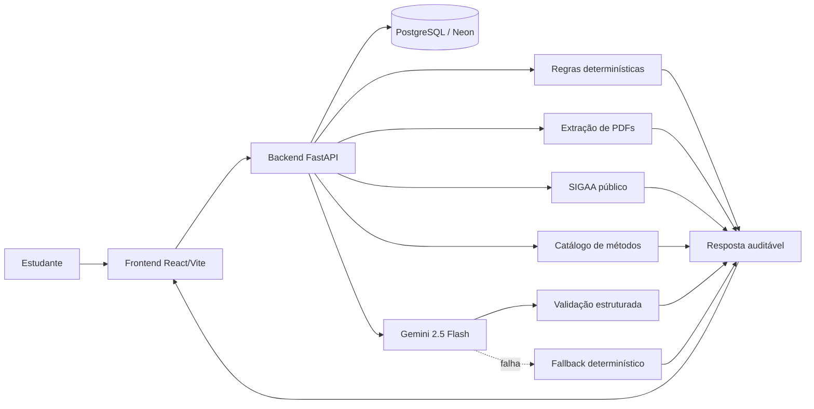
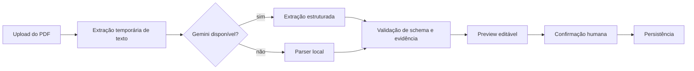
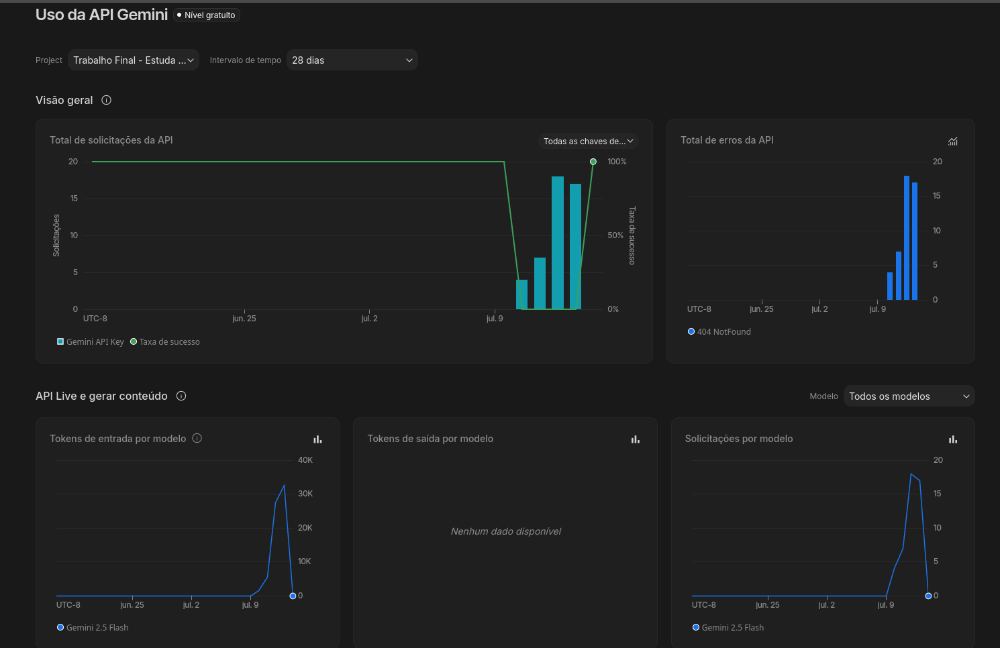
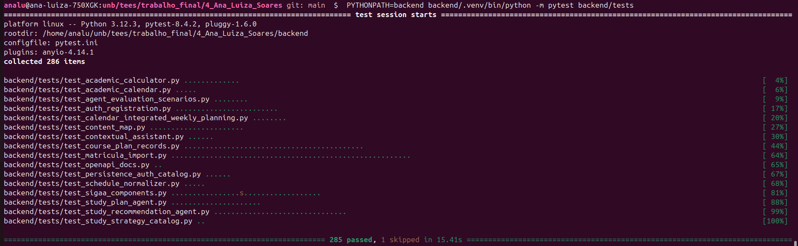

# Relatório Final — EstudaUnB

**Disciplina:** Trabalho Final de Machine Learning / Agentes de IA  

**Trilha:** 4 — Projeto aberto  

**Autora:** Ana Luiza Soares de Carvalho 

**Repositório:** [https://github.com/Ana-Luiza-SC/projeto-final-ML-2026-1](https://github.com/Ana-Luiza-SC/projeto-final-ML-2026-1)  

**Aplicação:** [https://name-estudaunb-frontend.onrender.com/](https://name-estudaunb-frontend.onrender.com/)  

**API:** [https://projeto-final-ml-2026-1.onrender.com/docs](https://projeto-final-ml-2026-1.onrender.com/docs)

**Vídeo de demonstração com usuário:** [https://drive.google.com/file/d/1cn-L3346V5woTb07Fe6MSc9xTr_eIgEq/view?usp=sharing](https://drive.google.com/file/d/1cn-L3346V5woTb07Fe6MSc9xTr_eIgEq/view?usp=sharing)  

---

## 1. Resumo

O EstudaUnB é uma aplicação web voltada a estudantes da Universidade de Brasília que precisam organizar disciplinas, avaliações, frequência, conteúdos e disponibilidade semanal. O sistema transforma dados acadêmicos fragmentados em informações estruturadas, prioridades de estudo, blocos planejados no calendário e recomendações contextualizadas.

O projeto implementa o ciclo **agente → API → produto**. O frontend em React consome uma API FastAPI, que centraliza regras acadêmicas determinísticas, persistência, extração de documentos, consulta a dados públicos do SIGAA, planejamento semanal e integração opcional com o modelo Gemini. Quando o provedor de IA não está disponível ou produz uma resposta inválida, o sistema utiliza fallback determinístico.

O produto foi desenvolvido por meio de **Spec-Driven Development (SDD)**. As funcionalidades foram especificadas antes da implementação, versionadas no repositório e refinadas conforme problemas de domínio e de experiência do usuário foram identificados.

## 2. Problema

Estudantes recebem informações acadêmicas por diferentes meios: atestado de matrícula, plano de ensino, calendário, mensagens de docentes e registros pessoais. Esses dados frequentemente não estão organizados em uma visão única e acionável.

As principais dificuldades tratadas são:

- cadastrar disciplinas sem repetir informações manualmente;
- identificar avaliações, datas e pesos a partir de planos de ensino;
- acompanhar nota, menção, frequência e risco acadêmico;
- relacionar avaliações aos conteúdos;
- decidir o que estudar primeiro;
- distribuir o estudo dentro da disponibilidade semanal;
- visualizar provas, trabalhos e blocos planejados em calendário;
- receber explicações sem transferir ao modelo de linguagem a autoridade sobre fatos acadêmicos.

### 2.1 Stakeholders

- estudantes da Universidade de Brasília;
- docentes e orientadores;
- avaliadores da disciplina;
- mantenedores da aplicação.

### 2.2 Objetivo de negócio

Permitir que um estudante transforme seus dados acadêmicos em um planejamento de estudos compreensível e utilizável, sem depender de conhecimento técnico ou organização manual dispersa.

### 2.3 Métricas de sucesso

#### Métrica de negócio

Percentual de tarefas centrais concluídas por um estudante sem intervenção da desenvolvedora:

1. entrar ou criar conta;
2. importar ou cadastrar disciplina;
3. confirmar avaliações;
4. consultar desempenho e frequência;
5. configurar disponibilidade;
6. gerar e confirmar planejamento;
7. localizar os blocos no calendário.

#### Métricas técnicas

- completude da extração de planos de ensino;
- taxa de planos gerados sem conflito;
- taxa de acionamento do fallback;
- taxa de respostas rejeitadas por guardrails;
- latência média e percentil 95;
- taxa de erros por endpoint;
- resultado dos testes automatizados;
- sucesso do build do frontend.

> **Limitação:** as métricas operacionais agregadas ainda não foram consolidadas em um painel próprio da aplicação.

## 3. Processo de desenvolvimento com SDD

O projeto adotou **Spec-Driven Development** para reduzir ambiguidade e manter rastreabilidade entre requisitos, implementação e testes.

As especificações canônicas estão em [`specs/`](specs/README.md), em inglês, para padronizar a interpretação por agentes de desenvolvimento. As traduções para Português do Brasil estão em [`spec_traduzido/`](spec_traduzido/README.md).

O uso de SDD permitiu:

- dividir o projeto em incrementos verificáveis;
- registrar critérios de aceitação antes da implementação;
- documentar decisões de arquitetura;
- preservar abordagens antigas como histórico;
- marcar comportamentos superseded ou legados;
- relacionar requisitos a arquivos e testes;
- orientar implementações realizadas com assistência de IA;
- evitar que mudanças de UX alterassem silenciosamente regras de negócio.

Exemplos de evolução:

- o planejamento inicial utilizava prioridade numérica manual;
- versões posteriores moveram a prioridade para o backend;
- “sessões” rígidas foram substituídas por blocos planejados;
- o calendário deixou de duplicar uma agenda semanal abaixo do mês;
- baixa disponibilidade de evidência deixou de ser tratada como baixa complexidade;
- mutações propostas pelo assistente passaram a exigir confirmação explícita.

A rastreabilidade consolidada está em [`docs/spec-traceability.md`](docs/spec-traceability.md).

## 4. Arquitetura



### 4.1 Componentes

- **Frontend:** React, Vite e TypeScript.
- **Backend:** FastAPI, Pydantic, SQLAlchemy e Alembic.
- **Banco local:** SQLite.
- **Banco em produção:** PostgreSQL/Neon.
- **Deploy:** Render Static Site e Render Web Service.
- **Modelo opcional:** Gemini 2.5 Flash.
- **Fonte externa:** páginas públicas do SIGAA/UnB.
- **Base de conhecimento:** catálogo versionado de métodos de estudo.
- **Fallback:** regras determinísticas e parser local.

### 4.2 Autoridade dos dados

O modelo de linguagem não é autoridade para notas, pesos, datas, menções, frequência, prioridade final ou persistência direta. Esses dados são calculados ou validados pelo backend.

## 5. Dados e contexto

| Fonte | Uso | Tratamento |
|---|---|---|
| Atestado de matrícula | Cadastrar disciplinas | Extração local, preview e confirmação |
| Plano de ensino | Avaliações, conteúdos, datas e bibliografia | Extração temporária, validação e confirmação |
| SIGAA público | Código, nome, carga horária e ementa | Consulta pública sem autenticação |
| Dados do estudante | Notas, faltas e disponibilidade | Persistência isolada por usuário |
| Catálogo de métodos | Recomendações de estudo | JSON versionado e auditável |
| Fixtures sintéticas | Testes | Dados não reais para preservar privacidade |

### 5.1 Privacidade

- o PDF bruto não é armazenado por padrão;
- os dados estruturados só são persistidos após confirmação;
- a aplicação não solicita credenciais do SIGAA;
- logs não devem registrar senha, token, chave ou documento integral;
- os dados são isolados por usuário;
- o teste com usuário utilizou dados simulados.

## 6. Agente e modelo

### 6.1 Papel do agente

O agente explica prioridades, contextualiza risco acadêmico, recomenda métodos de estudo, interpreta disponibilidade, sugere próximos passos, propõe ações estruturadas e explica falta de capacidade.

### 6.2 Modelo

O provedor configurado é o **Google Gemini**, com uso do modelo `gemini-2.5-flash` na configuração de referência. A escolha busca equilibrar custo, latência, capacidade de seguir saída estruturada e disponibilidade no nível gratuito.

### 6.3 Baseline determinístico

O backend calcula nota, menção, frequência, risco, proximidade de prazo, prioridade, conflitos de calendário, capacidade semanal e elegibilidade de ações.

### 6.4 Fallback

O fallback é acionado quando a chave não está configurada, o provedor demora, o modelo retorna erro, a resposta não é JSON válido, o schema é inválido ou a saída contradiz fatos.

## 7. Guardrails

- não inventar data, peso, nota, ementa ou professor;
- não avaliar docentes;
- não afirmar aprovação sem frequência conhecida;
- não preparar estudo depois da avaliação relacionada;
- rejeitar saída estruturada inválida;
- impedir alteração de dados sem confirmação;
- reconstruir ações no backend;
- validar autorização e isolamento por usuário;
- não exibir erro técnico cru;
- não inferir “estilo de aprendizagem” fixo;
- tratar ausência de evidência como incerteza.

## 8. Funcionalidades principais

- autenticação e cadastro controlado por configuração;
- importação de atestado de matrícula;
- cadastro manual de disciplinas;
- integração pública com o SIGAA;
- extração de plano de ensino;
- conteúdos hierárquicos;
- avaliações, notas, menção e frequência;
- planejamento semanal por disponibilidade;
- prioridade automática;
- calendário mensal e semanal;
- eventos recorrentes;
- assistente contextual;
- catálogo de métodos de estudo;
- fallback determinístico.

## 9. Extração de planos de ensino



O parser local foi aprimorado para reconhecer títulos numerados, seções, tabelas achatadas, avaliações, datas, pesos, conteúdos, objetivos, cronograma e bibliografia.

## 10. Integração SIGAA

A integração usa apenas páginas públicas e implementa sessão HTTP, `javax.faces.ViewState`, campos dinâmicos, busca, seleção de turma, extração semântica, sanitização, cache e fallback manual.

## 11. Base de métodos de estudo

O projeto possui um catálogo versionado com prática de recuperação, prática distribuída, intercalação, exemplos resolvidos, autoexplicação e Pomodoro como formato de gestão de tempo.

Arquivos:

- `study_methods.json`: fonte canônica;
- `evidence_based_study_methods_rag.pdf`: artefato humano auditável.

O sistema atual lê o JSON diretamente. Não há banco vetorial ou embeddings em produção. A base é **RAG-ready**, mas não deve ser descrita como RAG vetorial implementado.

## 12. Observabilidade e uso da API Gemini

A aplicação registra, no mínimo, latência, modo utilizado, fallback, categoria do fallback, eventos extraídos e rejeitados, planos gerados e ações bloqueadas por prazo.



A captura apresenta o painel de uso da API Gemini em um intervalo de 28 dias. O painel evidencia chamadas ao modelo `Gemini 2.5 Flash`, consumo de tokens de entrada e ocorrências de erro `404 NotFound`. No recorte apresentado, não há dados de tokens de saída.

A imagem comprova uso e falhas observadas, mas não substitui métricas internas agregadas de latência, custo, taxa de fallback ou qualidade. Não é seguro inferir totais exatos apenas pela leitura visual do gráfico.

## 13. Avaliação

### 13.1 Testes automatizados

Nos últimos registros de validação foram reportados:

- 246 testes aprovados;
- 1 teste ignorado;
- build do frontend aprovado;
- testes focados de SIGAA aprovados;
- testes focados de plano de ensino aprovados;
- migration em banco limpo aprovada.




Esses resultados correspondem às execuções registradas durante o desenvolvimento. O repositório contém os testes e instruções necessárias para reprodução.

### 13.2 Teste exploratório com usuário

Foi realizada uma sessão com um estudante da UnB, usando dados simulados para preservar a privacidade. O participante realizou login, importou um comprovante, confirmou disciplinas, enviou um plano de ensino, revisou avaliações, registrou notas e falta, configurou disponibilidade, gerou o planejamento, verificou os blocos no calendário e utilizou o assistente.

As tarefas principais foram concluídas. O teste identificou um problema na explicação de capacidade oferecida pelo assistente.

Por envolver apenas um participante, a sessão é caracterizada como uma avaliação exploratória de usabilidade e não permite generalização estatística dos resultados.

[Ver ata do teste com usuário](assets/ata-teste-usuario.pdf)

## 14. Experiência do usuário

As principais decisões de UX foram:

- separar planejamento de calendário;
- remover prioridade numérica manual;
- derivar horas semanais das janelas;
- não impor duração máxima por sessão;
- distinguir planejamento de execução;
- não tratar Pomodoro como padrão;
- exibir incerteza quando faltam dados;
- exigir confirmação para persistência;
- manter o assistente recolhível;
- evitar duplicação entre mês e semana.

## 15. Tentativas que não funcionaram

- o parser inicial não reconhecia tabelas achatadas;
- a busca SIGAA simples falhou por causa do fluxo JSF;
- prioridade manual gerava carga cognitiva;
- sessões rígidas não representavam a forma real de estudo;
- baixa evidência foi inicialmente confundida com baixa complexidade;
- o cadastro inicial era apenas demonstrativo.

Essas limitações motivaram mudanças de arquitetura e UX registradas nas specs.

## 16. Ética, privacidade e segurança

Erros podem causar priorização inadequada, interpretação errada de nota, preparação insuficiente ou confiança indevida em dados extraídos.

Mitigações:

- fatos acadêmicos determinísticos;
- confirmação humana;
- isolamento por usuário;
- ausência de persistência do PDF bruto por padrão;
- fallback;
- mensagens de incerteza;
- bloqueio de mutações diretas pelo LLM;
- dados simulados na avaliação;
- ausência de credenciais do SIGAA.

O produto é ferramenta de apoio e não substitui os sistemas oficiais da universidade.

## 17. Limitações

- não há integração com Google Calendar;
- não há notificações;
- não há recuperação de senha;
- não há login social;
- não há rate limiting distribuído;
- a integração SIGAA é frágil;
- o frontend tem menos testes que o backend;
- não há monitoramento agregado completo;
- não há timer de atividade;
- não há adaptação pós-estudo implementada;
- não há RAG vetorial em produção;
- o teste de UX possui apenas um participante.

## 18. Próximos passos

- corrigir a explicação de capacidade;
- consolidar métricas;
- incluir p50 e p95 de latência;
- calcular taxa de fallback;
- adicionar rate limiting;
- aumentar testes de frontend;
- criar histórico de atividades;
- implementar feedback pós-estudo;
- integrar calendário externo;
- ampliar avaliação com mais participantes.

## 19. Demonstração

[Assistir à demonstração com usuário real](https://drive.google.com/file/d/1cn-L3346V5woTb07Fe6MSc9xTr_eIgEq/view?usp=sharing)

## 20. Reprodutibilidade

```bash
git clone https://github.com/Ana-Luiza-SC/projeto-final-ML-2026-1
cd projeto-final-ML-2026-1/4_Ana_Luiza_Soares
cp .env.example .env
docker compose up --build
```

## 21. Referências

### Documentação técnica

- Google AI for Developers. **Gemini API Documentation**. Documentação utilizada na integração com o modelo Gemini 2.5 Flash.
- FastAPI. **FastAPI Documentation**. Documentação utilizada para implementação da API REST.
- React. **React Documentation**. Documentação utilizada no desenvolvimento da interface.
- Vite. **Vite Documentation**. Documentação utilizada na configuração e build do frontend.
- SQLAlchemy. **SQLAlchemy Documentation**. Documentação utilizada para persistência e acesso ao banco de dados.
- Alembic. **Alembic Documentation**. Documentação utilizada no versionamento das migrações.
- Render. **Render Documentation**. Documentação utilizada para publicação da aplicação.
- Neon. **Neon Documentation**. Documentação utilizada para configuração do banco PostgreSQL.
- Universidade de Brasília. **SIGAA público — componentes curriculares e turmas**. Fonte pública utilizada para consulta de dados acadêmicos.

### Métodos de estudo

As referências acadêmicas utilizadas no catálogo de métodos estão registradas nos seguintes arquivos:

- [`backend/app/knowledge/study_methods/README.md`](backend/app/knowledge/study_methods/README.md)
- [`backend/app/knowledge/study_methods/study_methods.json`](backend/app/knowledge/study_methods/study_methods.json)
- [`backend/app/knowledge/study_methods/evidence_based_study_methods_rag.pdf`](backend/app/knowledge/study_methods/evidence_based_study_methods_rag.pdf)

### Materiais da disciplina e documentação do projeto

- Especificação do Trabalho Final da disciplina.
- Materiais de aula sobre agentes, guardrails, fallback, avaliação, observabilidade e Spec-Driven Development.
- [`README.md`](README.md)
- [`specs/README.md`](specs/README.md)
- [`spec_traduzido/README.md`](spec_traduzido/README.md)
- [`docs/spec-traceability.md`](docs/spec-traceability.md)
- [`docs/evidence/README.md`](docs/evidence/README.md)
- [`docs/diagrams/README.md`](docs/diagrams/README.md)

### Evidências complementares

- [Painel de uso da API Gemini](assets/api-usage.png)
- [Ata do teste exploratório com usuário](assets/ata-teste-usuario.pdf)
- [Vídeo de demonstração](https://drive.google.com/file/d/1cn-L3346V5woTb07Fe6MSc9xTr_eIgEq/view?usp=sharing)