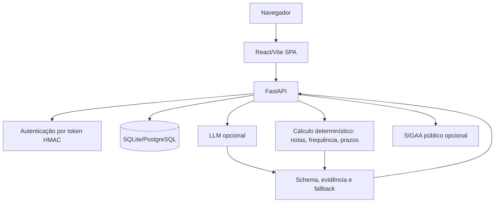

# Arquitetura do EstudaUnB

Diagramas reutilizáveis e revisados: [`diagrams/README.md`](diagrams/README.md). Rastreabilidade de capacidades: [`spec-traceability.md`](spec-traceability.md).

O EstudaUnB usa uma arquitetura simples de MVP: frontend React/Vite, backend FastAPI e banco relacional via SQLAlchemy. Em desenvolvimento o banco padrão é SQLite; em produção, `DATABASE_URL` deve apontar para PostgreSQL compatível.

## Persistência

Tabelas principais: `users`, `disciplines`, `assessments`, `academic_events`, `absences`, `course_plans`, `content_nodes`, `assessment_content_links`, `catalog_components` e `complexity_analyses`. Registros acadêmicos são isolados por `user_id`.

## Calendário

`academic_events` é projeção temporal. Avaliações continuam sendo a fonte acadêmica de verdade; eventos de origem `assessment` são atualizados pela avaliação. Eventos de origem `course_plan` dependem de preview e confirmação humana.

## Guardrails

- Sem login no SIGAA.
- Sem scraping autenticado.
- Sem armazenamento de PDF bruto por padrão.
- Sem dados pessoais em logs.
- Sem sessão de estudo depois do prazo da avaliação.

## Planejamento e atividades

`/study-plan` calcula prioridade, demanda estimada, capacidade e blocos planejados. A confirmação persiste blocos como eventos; ela não registra execução. O ciclo de **study activity** da Spec 015 e a adaptação da Spec 016 ainda não existem. O serviço legado de sessões permanece apenas para compatibilidade.
