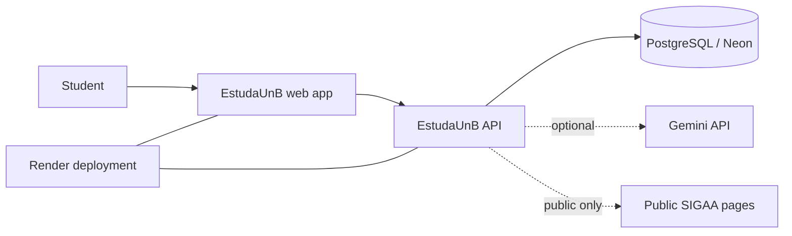
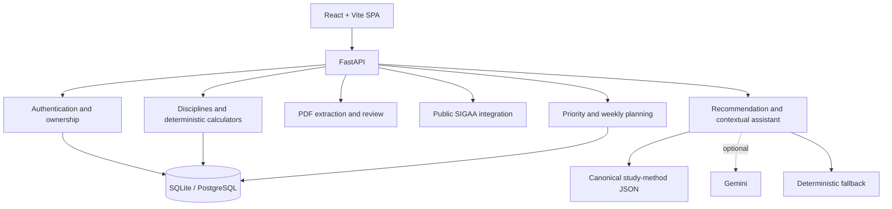
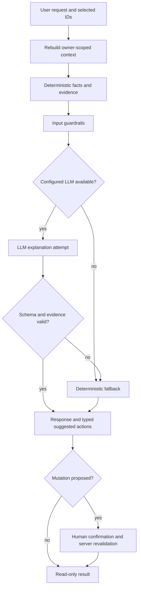
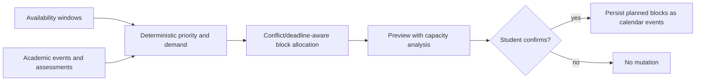
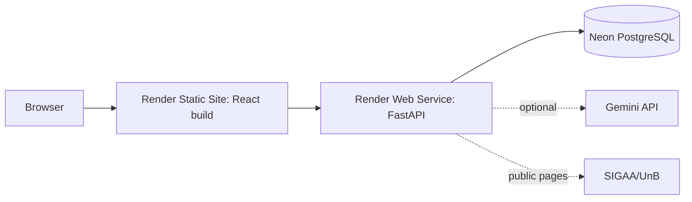
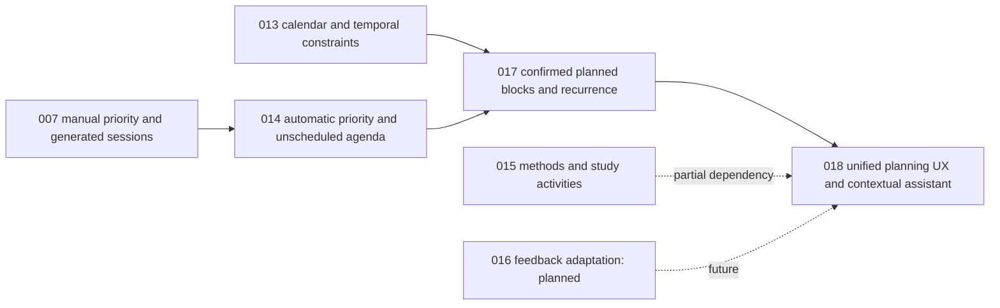

# EstudaUnB diagrams

Reviewed: 2026-07-13.

Mermaid source lives in `src/`. Rendered output belongs in `rendered/`; no SVG is committed in this review because Mermaid CLI (`mmdc`) was not available. GitHub-readable copies are embedded below and in the report where useful.

Regenerate when Mermaid CLI is installed:

```bash
for file in docs/diagrams/src/*.mmd; do mmdc -i "$file" -o "docs/diagrams/rendered/$(basename "${file%.mmd}").svg"; done
```

| Diagram | Source | Related specs | Embedded here |
| --- | --- | --- | --- |
| System context | [`src/system-context.mmd`](src/system-context.mmd) | 004, 006, 012, 013, 018 | Yes |
| Containers/services | [`src/container-architecture.mmd`](src/container-architecture.mmd) | 001–018 | Yes |
| Agent decision flow | [`src/agent-decision-flow.mmd`](src/agent-decision-flow.mmd) | 003, 005, 015, 018 | Yes |
| Weekly planning | [`src/weekly-planning-flow.mmd`](src/weekly-planning-flow.mmd) | 014, 017, 018 | Yes |
| Course-plan import | [`src/course-plan-import.mmd`](src/course-plan-import.mmd) | 009, 018 | No |
| SIGAA enrichment | [`src/sigaa-enrichment.mmd`](src/sigaa-enrichment.mmd) | 006, 010, 018 | No |
| Data model | [`src/data-model.mmd`](src/data-model.mmd) | 009, 011–013, 017 | No |
| Deployment | [`src/deployment.mmd`](src/deployment.mmd) | 004, 013 | Yes |
| Specification evolution | [`src/spec-evolution.mmd`](src/spec-evolution.mmd) | 007, 013, 014, 017, 018 | Yes |

## System context



## Container architecture



## Agent decision flow



## Weekly planning flow



## Deployment



## Specification evolution


