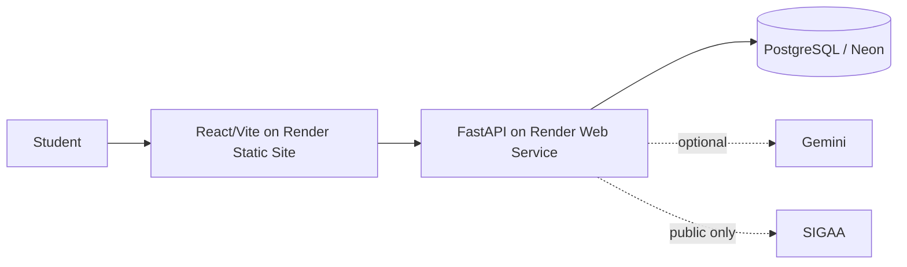

# EstudaUnB public report draft

> Draft reviewed 2026-07-13. Placeholders are explicit; no unmeasured result is presented as fact.

- Application: **TODO: insert verified public application URL**
- Repository: this repository, directory `4_Ana_Luiza_Soares/`
- Author/team: **TODO: confirm final public author/team presentation**
- Demonstration video: **TODO: insert final demonstration video URL**

## Problem and stakeholders

EstudaUnB helps UnB students turn fragmented discipline, assessment, attendance, course-plan, and availability information into auditable academic organization and study guidance. Stakeholders are students, course instructors/advisors, project evaluators, and maintainers.

Business success should be evaluated by whether a representative student can import or create a discipline, register an assessment, understand academic risk, and obtain an actionable plan without technical assistance. **TODO: run and report the final task-completion study.**

Technical metrics must include endpoint latency, error rate, fallback rate, guardrail outcomes, response completeness, and provider cost where applicable. **TODO: insert measured p50/p95 latency, fallback rate, error rate, and cost.**

## Architecture and deployment

Local development defaults to SQLite. Production configuration is prepared for Render and a PostgreSQL-compatible service such as Neon, but this checkout contains no verified public deployment evidence.

## Agent and model exploration

The baseline is deterministic: academic calculations, priority, deadlines, scheduling constraints, and fallbacks are backend-owned. Gemini (`gemini-2.5-flash` in the example configuration) is optional and may explain validated facts. The system rejects invalid structured output and falls back without requiring a provider key. The repository documents earlier generated-session planning and later moves to automatic priority, planned blocks, and a contextual assistant.

**TODO: add a dated prompt/design iteration table and any rejected approaches supported by experiment notes.**

## Data sources and licensing

- Student-entered or human-confirmed academic data.
- Uploaded enrollment/course-plan PDFs, processed temporarily and not stored raw by default.
- Public SIGAA/UnB component and turma pages, accessed best effort without authentication.
- Versioned `study_methods.json`, with the bundled PDF as a human audit source. The JSON and PDF must not both be embedded into one retrieval collection.

**TODO: confirm and document the applicable public-source terms/license statement for SIGAA data and every bibliography item.**

## Guardrails, fallback, and observability

The system isolates records by user, does not request SIGAA credentials, validates PDF/schema/evidence, does not let an LLM calculate authoritative grades or write directly to storage, and requires confirmation for proposed mutations. Logs are designed to capture latency, mode, fallback category, and counts without secrets or raw personal documents. No aggregated production monitoring evidence exists yet.

## Evaluation methodology

Automated tests cover deterministic calculations, eight baseline recommendation scenarios, fallback paths, content evidence, PDF parsing, SIGAA fixtures, authentication isolation, calendar recurrence, planning capacity, and contextual action confirmation. Manual evaluation must still cover deployed smoke behavior, representative UX, jailbreak/out-of-scope prompts, and measured operational metrics.

## UX

The product separates planned study blocks from actual study activities. `/study-plan` owns availability, automatic priority, capacity explanation, preview, and confirmation. `/calendar` provides Month and temporal Week views plus recurring manual events. The contextual assistant is read-only until an explicit, typed action is confirmed.

## Ethics, privacy, and security

Incorrect guidance could cause a learner to misallocate time or misunderstand academic risk. Mitigations include deterministic academic facts, uncertainty for missing evidence, no claims about professor quality or historical failure rate, no medical/psychological diagnosis, human review of extracted data, user isolation, and no raw-PDF retention by default. This is guidance, not an official SIGAA result.

## Failed or superseded approaches

Legacy planning required manual numeric priorities, weekly-hour duplication, a maximum session duration, and generated-session language. Specs 014, 017, and 018 replace that UX with backend priority, availability windows, planned blocks, capacity analysis, and confirmation. Missing syllabus must mean insufficient evidence, not low demand. The current `dev` branch also lacks the registration feature that exists on `main`; this report does not claim it.

## Limitations and future work

- Study-activity timers and completion lifecycle from Spec 015 are not implemented.
- Post-study feedback/adaptation from Spec 016 is planned.
- No external calendar sync, notifications, password recovery, login social, or verified public deployment.
- Public SIGAA parsing is inherently fragile and must degrade gracefully.
- **TODO: final screenshots, accessibility review, measured usability, deployment smoke, final report URL, and video.**

## References

See the study-method catalog README/PDF and the citations listed in `docs/avaliacao-agente.md`. **TODO: normalize the final bibliography and license notes.**
